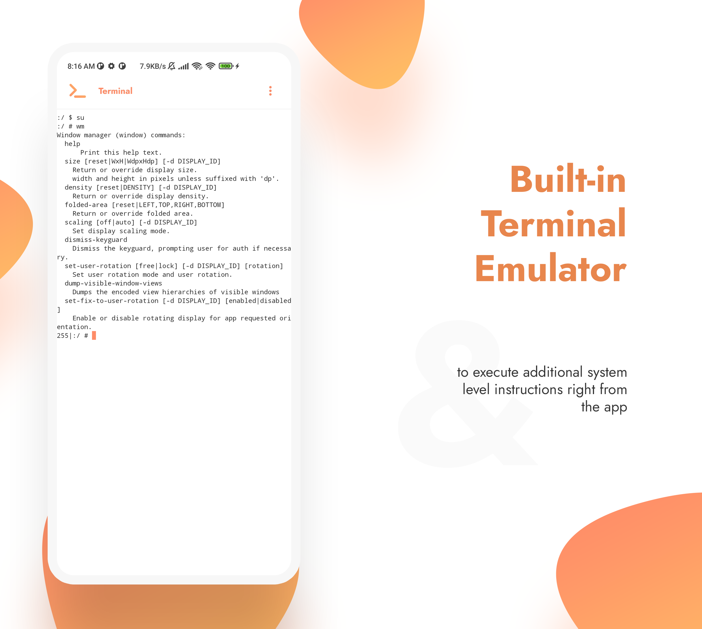

# Inure App Manager

An elegant Android app manager.

## Stats

[&logo=github&logoColor=white)](https://tooomm.github.io/github-release-stats/?username=Hamza417&repository=Inure)

-839192?logo=android&logoColor=white)
-566573?logo=android&logoColor=white)

## Download

[-181717?logo=github)](https://github.com/Hamza417/Inure/actions/workflows/build_apk.yml)
[-181717?logo=github)](https://github.com/Hamza417/Inure/actions/workflows/build_release_apk.yml)

**Update (27 Sept, 2023):** Inure is now available to download on Play Store after 20 days of absence, thanks everyone for their patience :)

## Buy (Full Version)

[-Purchase-23a094?logo=gumroad&logoColor=white)](https://hamza417.gumroad.com/l/inure_unlocker/)
[-Purchase-ea4335?logo=googleplay)](https://play.google.com/store/apps/details?id=app.simple.inureunlocker)
[-Purchase-ffffff?logo=github)](https://github.com/sponsors/Hamza417/sponsorships?sponsor=Hamza417&tier_id=262253)
[-Purchase-FF5E5B?logo=kofi&logoColor=white)](https://ko-fi.com/s/c1f0cb960f)

## Featured

- [Android Weekly Issue #465](https://androidweekly.net/issues/issue-465)
- ["Inure, a beautifully animated Android App Manager." - Android Dev Notes](https://twitter.com/androiddevnotes/status/1389111968670179340)
- [Top 5 Android Apps of the Week - NextPit](https://www.nextpit.com/apps-of-the-week-51-2021)
- [5 Super Useful OPENSOURCE Apps for Android - TechDoc](https://youtu.be/vlf0jEFHR74)
- [Best Android Apps - February 2023 - HowToMen](https://youtu.be/kOrnfQOz4rg?t=112)
- [5 Magnificent Open Source Android Apps To Download Right NOW! - Anubhav Roy](https://youtu.be/kvM9hGJJ2wA?t=357)
- [Top Android Apps! (May 2023) - Sam Beckman](https://youtu.be/g6pMQAFfd3Q?t=220)
- [8 Legendary Android Apps You Must INSTALL NOW - May 2023!](https://www.youtube.com/watch?v=YbnNmnd5JrE&t=268s)
- [Apps that Will LEVEL Up Your Smartphone Experience in 2023! - Sam Beckman](https://youtu.be/EtOq5ccjv5s?t=121)
- [The Most Functional App Ever! - Sam Beckamn](https://www.youtube.com/shorts/WYoWLMKawBg)

## About

Inure is an Android application package manager irrespective of whether they're installed or not, it
can scan through any app's internal components and modify them on the go. It also packs a nice
looking Terminal Emulator, Usage Stats, Split/APK Installer and various other tools and many of them
are waiting to be implemented as well. On top of that, Inure's all functionalities been made to
work with both Root and Shizuku modes.

Inure's development was started as an independent learning project which later has become one of the
most ambitious and intuitive Android apps developed by a single person and is based 100% on custom
UI APIs developed to be used only in this app with its own native theme engine, crash handler, image
renderer and a beautiful animation framework. There's also an implementation for PC like mouse hover
effects and click interactions for tablet and PC users.

Along with it own UI perks, Inure also supports dynamic Material You colors with dedicated accent
and
theme color modes.

See the [concise list of features of the app here](./FEATURES.md).

The app is in stable testing stage. You can join
app's [Telegram Group](https://t.me/inure_app_manager)
and submit your feedbacks or get development related updates.

## Development Status

### High priority features

- [x] Add basic Shizuku support.
- [x] Apps Backup feature.
- [x] Dedicated app installer.
- [x] External APK information.
- [x] Proper analytics panel.
- [x] App directories panel.
- [x] APK browser for apps that are not yet installed.
- [x] Modify Shared Prefs of other apps _(root)_.
- [x] Add battery optimisation manager for all apps.
- [x] Boot manager for all apps.
- [x] Add option to disable trackers.
- [x] Create activity shortcut on homescreen.
- [ ] Add multiple apk installer.
- [x] Selection framework for APKs panel
- [ ] Batch tracker control.

### Low priority features

- [x] Dedicated TextEditor.
- [x] ImageViewer scalable zoom support.
- [ ] APK data extraction.

## Screenshots

### App's Interface

|  |  |  | 
|:---------------------------------------------------------------------:|:---------------------------------------------------------------------:|:---------------------------------------------------------------------:|
|                                 0x01                                  |                                 0x02                                  |                                 0x03                                  |

|  |  |  |
|:---------------------------------------------------------------------:|:---------------------------------------------------------------------:|:---------------------------------------------------------------------:|
|                                 0x04                                  |                                 0x05                                  |                                 0x06                                  |  

|  |  |  |
|:---------------------------------------------------------------------:|:---------------------------------------------------------------------:|:---------------------------------------------------------------------:|
|                                 0x07                                  |                                 0x08                                  |                                 0x09                                  | 

|  |  |  |
|:---------------------------------------------------------------------:|:---------------------------------------------------------------------:|:---------------------------------------------------------------------:|
|                                 0x00                                  |                                 0x0A                                  |                                 0x0B                                  |

|  |  |  | 
|:---------------------------------------------------------------------:|:---------------------------------------------------------------------:|:---------------------------------------------------------------------:|
|                                 0x0C                                  |                                 0x0D                                  |                                 0x0E                                  |

|  |  |  |
|:---------------------------------------------------------------------:|:---------------------------------------------------------------------:|:---------------------------------------------------------------------:|
|                                 0x0F                                  |                                 0x11                                  |                                 0x12                                  | 

|  |  |  |
|:---------------------------------------------------------------------:|:---------------------------------------------------------------------:|:---------------------------------------------------------------------:|
|                                 0x13                                  |                                 0x14                                  |                                 0x15                                  | 

|  |  |  |
|:---------------------------------------------------------------------:|:---------------------------------------------------------------------:|:---------------------------------------------------------------------:|
|                                 0x16                                  |                                 0x17                                  |                                 0x18                                  |

|  |  |  |
|:---------------------------------------------------------------------:|:---------------------------------------------------------------------:|:---------------------------------------------------------------------:|
|                                 0x19                                  |                                 0x1A                                  |                                 0x1B                                  |

|  |  |  |
|:---------------------------------------------------------------------:|:---------------------------------------------------------------------:|:---------------------------------------------------------------------:|
|                                 0x1C                                  |                                 0x1D                                  |                                 0x1E                                  |

### Accessibility

Various accessibility features to make the app more accessible to users.

|  |  |  |
|:---------------------------------------------------------------------:|:---------------------------------------------------------------------:|:---------------------------------------------------------------------:|
|                                 0x00                                  |                                 0x01                                  |                                 0x02                                  |

### Menus and Dialogs

Various styles of menus and dialogs used in the app.

|  |  |  |
|:---------------------------------------------------------------------:|:---------------------------------------------------------------------:|:---------------------------------------------------------------------:|
|                                 0x00                                  |                                 0x01                                  |                                 0x02                                  |

## Behind The Scenes

|                           |
|:-----------------------------------------------:|
|   Designing of interface skeletons for Inure    | 

|                |
|:---------------------------------------------:|
| Audio Player interface design (later removed) |

|          |
|:---------------------------------------:|
| Presentation design for Batch interface |

## Contribute

#### Developers

Inure's repo doesn't require any special setup, clone/fork the repo and run
in [Android Studio](https://developer.android.com/studio) and let the initial
setup finish automatically and you'll be good to go.

#### Not a developer?

You can take participation in app's translation on [Crowdin](https://crowdin.com/project/inure)
and watch Inure work in your language and make the app more user friendly to
everyone speaking your tongue... 😎😎

Alternatively, you can also edit/upload your locale's strings
from `app/src/main/res/values-locale-code` directory.

#### Want to show you were here?

You cannot do the above still wanna show your support? hit the star 🌟 and let me know you were here
and appreciate the project.. 😄

## License

**Inure App Manager** Copyright © 2023 - Hamza Rizwan

**Inure App Manager** is released as open source software under
the [GPL v3](https://opensource.org/licenses/gpl-3.0.html)
license, see the [LICENSE](./LICENSE) file in the project root for the full license text.
