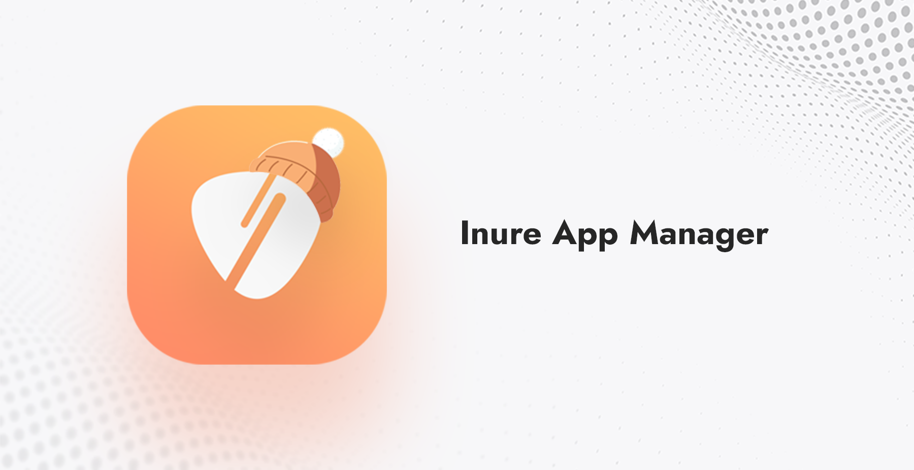
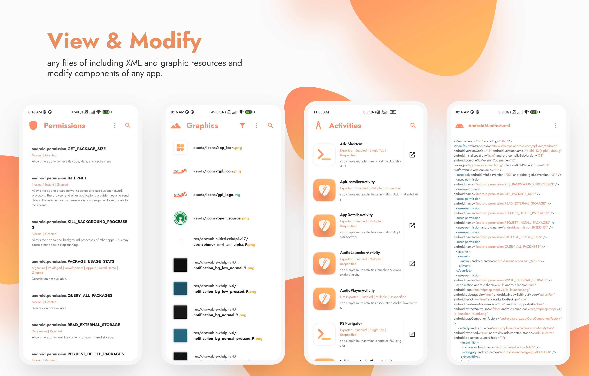

# Inure App Manager

An elegant Android app manager, currently in development

## Stats

## Download

## Buy

[-$4.99-23a094?logo=gumroad&logoColor=white)](https://hamza417.gumroad.com/l/inure_unlocker/)
[-~$4.99-ea4335?logo=googleplay)](https://play.google.com/store/apps/details?id=app.simple.inureunlocker)

## Featured

- [Android Weekly Issue #465](https://androidweekly.net/issues/issue-465)
- ["Inure, a beautifully animated Android App Manager." - Android Dev Notes](https://twitter.com/androiddevnotes/status/1389111968670179340)
- [Top 5 Android Apps of the Week - NextPit](https://www.nextpit.com/apps-of-the-week-51-2021)

## About

Inure is an Android application package manager irrespective of whether they're installed or not, it
can scan through any app's internal components and modify them on the go. It also packs a nice
looking Terminal Emulator, Usage Stats, Split/APK Installer and various other tools and many of them
are waiting to be implemented as well.

Inure's development was started as an independent learning project which later has become one of the
most ambitious and intuitive Android apps developed by a single person and is based 100% on custom
UI APIs developed to be used only in this app with its own native theme engine, crash handler, image
renderer and a beautiful animation framework.

Along with it own UI perks, Inure also supports dynamic Material You colors with split accent and
theme color modes.

Currently, the app is in beta testing stage. You can join app's early beta testing
from [Play Store](https://play.google.com/store/apps/details?id=app.simple.inure) and
its [Telegram Group](https://t.me/inure_app_manager) for development related updates
and discussions.

If you've tried the app, you can write your user/developer feedbacks [here](https://github.com/Hamza417/Inure/discussions/48).

## Future

The new [Build53](https://github.com/Hamza417/Inure/releases/tag/Build53) is live for everyone to update. I have finalized the Boot Manager and it should work as expected now. As of now it only supports complete enable or disable mode for an app. In the future, I'm expected to add a component management in Boot Manager so that you can allow some components to run while stop the others from running.

And, I have revamped the Development Preferences panel, it should be more stable to use now. I'm hoping to fix all the Preferences panel issue if time allows for that but I think it's stable as it is. Also, due to changes in Development, you might have to re-enable some settings.

I added option to disable image caching. You can use that to prevent app from taking up a lot of space in the storage. Disabling it shouldn't be affecting the app performance, in my tests the app continued to perform same under both conditions.

This build also finalizes the app's development and I have added almost everything I had planned for the app. Any new features might not be added anymore however I'll keep tweaking the app to make it more usable and stable as the time progresses and keep on improving all the existing features and everyone can expect one or two updates every month. You can however keep reporting the bugs and issues and I'll keep fixing them too.

That's all.

## Development Status

### High priority features

- [x] Apps Backup feature
- [x] Dedicated app installer
- [x] External APK information
- [x] Proper analytics panel
- [x] App directories panel
- [ ] APK browser for apps that are not yet installed
- [ ] Modify Shared Prefs of other apps (root).
- [ ] Modify SQLite databases of other apps (root).
- [ ] Multiple user support (suspended).
- [ ] Use app via ADB Shell instead of root? (suspended)
- [x] Add battery optimisation manager for all apps
- [x] Boot manager for all apps

### Low priority features

- [ ] Code highlights for all languages an Android app possibly contains
- [x] Dedicated TextEditor
- [x] ImageViewer scalable zoom support
- [ ] APK data extraction

*This list will be updated as the development progresses.*

<b>NOTE:</b> Inure is currently not expecting any feature requests or suggestions.

## Screenshots

|  |  |  |  |
|:---------------------------------------------------------------------:|:---------------------------------------------------------------------:|:---------------------------------------------------------------------:|:---------------------------------------------------------------------:|
|                                   1                                   |                                   2                                   |                                   3                                   |                                   4                                   |

|  |  |  |  |
|:---------------------------------------------------------------------:|:---------------------------------------------------------------------:|:---------------------------------------------------------------------:|:---------------------------------------------------------------------:|
|                                   5                                   |                                   6                                   |                                   7                                   |                                   8                                   |

|  |  |  |  |
|:---------------------------------------------------------------------:|:---------------------------------------------------------------------:|:---------------------------------------------------------------------:|:---------------------------------------------------------------------:|
|                                   9                                   |                                   0                                   |                                   A                                   |                                   B                                   |

|  |  |  |  |
|:---------------------------------------------------------------------:|:---------------------------------------------------------------------:|:---------------------------------------------------------------------:|:---------------------------------------------------------------------:|
|                                   C                                   |                                   D                                   |                                   E                                   |                                   F                                   |

## Behind The Scenes
|  |
|:-----------------------:|
| Designing of interface skeletons for Inure |

## License

**Inure App Manager** Copyright © 2022 - Hamza Rizwan

**Inure App Manager** is released as open source software under the [GPL v3](https://opensource.org/licenses/gpl-3.0.html) 
license, see the [LICENSE](./LICENSE) file in the project root for the full license text.

## Licence Limitations

The assets used in the app are created using Adobe Photoshop and Adobe Illustrator and despite the
project being GPLv3, these assets do not fall under the purview of any license. Therefore, you're not allowed 
to use any asset of the app in any _other_ projects. However, the app uses icons
available on [Material Icons Library](https://fonts.google.com/icons?icon.style=Rounded&icon.set=Material+Icons)
which are available under various open source licenses, so if need be, they can be downloaded from there.

Assets here refers to any graphics in both raster and vector form that are unique to Inure or represents
app's identity in some way including icons and animated vector files mustn't be replicated to other projects
without any prior permission. Any "Fair Use" is permissible/allowed.
