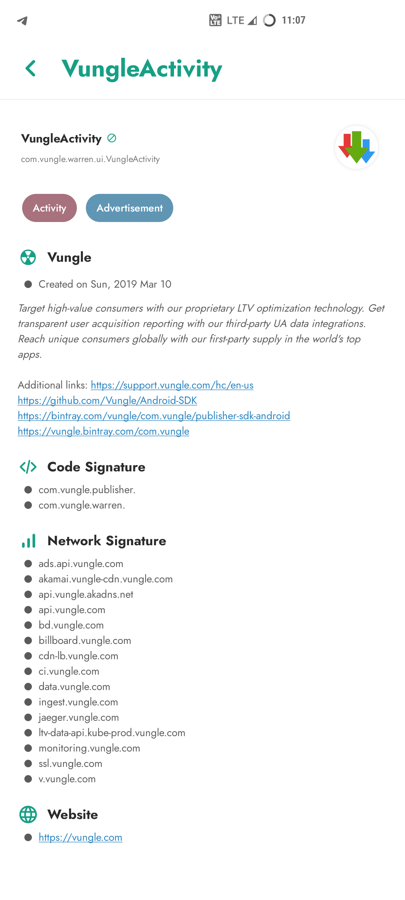

# Inure App Manager

An elegant Android app manager.

## Stats

[](https://ghloc.vercel.app/Hamza417/Inure?branch=master)
[&logo=github&logoColor=white)](https://tooomm.github.io/github-release-stats/?username=Hamza417&repository=Inure)
[](https://github.com/Hamza417/Inure/releases)


-839192?logo=android&logoColor=white)
-566573?logo=android&logoColor=white)
[](https://crowdin.com/project/inure)
[](https://t.me/inure_app_manager)
[](https://t.me/inure_app_grp)

## Download

[](https://play.google.com/store/apps/details?id=app.simple.inure.play)
[](https://github.com/Hamza417/Inure/releases/latest)
[](https://f-droid.org/en/packages/app.simple.inure/)
[](https://apt.izzysoft.de/fdroid/index/apk/app.simple.inure)
[](https://sourceforge.net/projects/inure-app-manager.mirror/)

## Buy (Full Version)

[-Purchase-23a094?logo=gumroad&logoColor=white)](https://hamza417.gumroad.com/l/inure_unlocker/)
[-Purchase-ea4335?logo=googleplay)](https://play.google.com/store/apps/details?id=app.simple.inureunlocker)
[-Purchase-ffffff?logo=github)](https://github.com/sponsors/Hamza417/sponsorships?sponsor=Hamza417&tier_id=262253)
[-Purchase-FF5E5B?logo=kofi&logoColor=white)](https://ko-fi.com/s/c1f0cb960f)

## Featured

- [**Android Weekly Issue #465**](https://androidweekly.net/issues/issue-465)
- [**"Inure, a beautifully animated Android App Manager."** - _Android Dev Notes_](https://twitter.com/androiddevnotes/status/1389111968670179340)
- [**Top 5 Android Apps of the Week** - _NextPit_](https://www.nextpit.com/apps-of-the-week-51-2021)
- [**5 Super Useful OPENSOURCE Apps for Android** - _TechDoc_](https://youtu.be/vlf0jEFHR74)
- [**Best Android Apps - February 2023** - _HowToMen_](https://youtu.be/kOrnfQOz4rg?t=112)
- [**5 Magnificent Open Source Android Apps To Download Right NOW!** - _Anubhav Roy_](https://youtu.be/kvM9hGJJ2wA?t=357)
- [**Top Android Apps! (May 2023)** - _Sam Beckman_](https://youtu.be/g6pMQAFfd3Q?t=220)
- [**8 Legendary Android Apps You Must INSTALL NOW - May 2023!** -  _Mr Android FHD_](https://www.youtube.com/watch?v=YbnNmnd5JrE&t=268s)
- [**Apps that Will LEVEL Up Your Smartphone Experience in 2023!** - _Sam Beckman_](https://youtu.be/EtOq5ccjv5s?t=121)
- [**The Most Functional App Ever!** - _Sam Beckman_](https://www.youtube.com/shorts/WYoWLMKawBg)
- [**Top 10 Android Apps! (October 2023)** - _Matt Robb_](https://youtu.be/Aiz2yqCHvwQ?t=2m49s)
- [**The Best Apps of 2023!** - _Sam Beckman_](https://youtu.be/NYZd7IKn1oY?t=202)
- [**Coolest Open Source projects of the week 🔥** - _Ana Mogul_](https://console.substack.com/p/console-190)
- [**10 Reasons to Root Your Phone in 2024!** - _Sam Beckman_](https://youtu.be/5Nxd9HLixO8?t=254)
- [**20 Android Apps I CAN'T Live Without in 2024!** - _Sam Beckman_](https://youtu.be/0sY3ehuYWR8?t=554)

## About

Inure is an Android application package manager irrespective of whether they're installed or not, it
can scan through any app's internal components and modify them on the go. It also packs a nice
looking Terminal Emulator, Usage Stats, Split/APK Installer and various other tools and many of them
are waiting to be implemented as well. On top of that, Inure's all functionalities been made to
work with both Root and Shizuku modes.

Inure's development was started as an independent learning project which later has become one of the
most ambitious and intuitive Android apps developed by a single person and is based 100% on custom
UI APIs developed to be used only in this app with its own native theme engine, crash handler, image
renderer and a beautiful animation framework.

Along with it own UI perks, Inure also supports dynamic Material You colors with dedicated accent
and theme color modes.

The app is in stable testing stage. You can join
app's [Telegram Group](https://t.me/inure_app_manager)
and get development related updates.

**Inure also supports fully reproducible builds**

### Features

See the [concise list of features of the app here](./FEATURES.md).

## Screenshots

### App's Interface

|  |  |  | 
|:-------------------------:|:-------------------------:|:-------------------------:|
|           0x01            |           0x02            |           0x03            |

|  |  |  |
|:-------------------------:|:-------------------------:|:-------------------------:|
|           0x04            |           0x05            |           0x06            |  

|  |  |  |
|:-------------------------:|:-------------------------:|:-------------------------:|
|           0x07            |           0x08            |           0x09            | 

|  |  |  |
|:-------------------------:|:-------------------------:|:-------------------------:|
|           0x00            |           0x0A            |           0x0B            |

|  |  |  | 
|:-------------------------:|:-------------------------:|:-------------------------:|
|           0x0C            |           0x0D            |           0x0E            |

|  |  |  |
|:-------------------------:|:-------------------------:|:-------------------------:|
|           0x0F            |           0x11            |           0x12            | 

|  |  |  |
|:-------------------------:|:-------------------------:|:-------------------------:|
|           0x13            |           0x14            |           0x15            | 

|  |  |  |
|:-------------------------:|:-------------------------:|:-------------------------:|
|           0x16            |           0x17            |           0x18            |

|  |  |  |
|:-------------------------:|:-------------------------:|:-------------------------:|
|           0x19            |           0x1A            |           0x1B            |

|  |  |  |
|:-------------------------:|:-------------------------:|:-------------------------:|
|           0x1C            |           0x1D            |           0x1E            |

|  |  |  |
|:-------------------------:|:-------------------------:|:-------------------------:|
|           0x1F            |           0x20            |           0x21            |

### Accessibility

Various accessibility features to make the app more accessible to users. Inure also supports an
option to add more colors to interface of various
types including Pastel, Coffee (soothing) and Retro (color blocked) for users who don't prefer
monochromatic interface or have difficulty using it.

Including that, Inure also supports highlighting clickable elements and divider for users who
have difficulty in differentiating spaces between interface elements.

Further more, it's also possible to disable all animations to reduce excessive motion in the
app. Inure has options to adjust animation requirements over multiple levels from all animations to no 
animations with fine granularity.

|  |  |  |
|:-------------------------:|:-------------------------:|:-------------------------:|
|           0x00            |           0x01            |           0x02            |

### Menus and Dialogs

Inure has 3 different styles of Menu and Dialogs type depending on how they're required, the popup type used for quick actions follows the user thumb on the screen,
the modal dialog is used to adjust panel level preferences and chip style dialog for managing filter flags and tags. These three work together to refine a good level
of UX and UI without overloading the user with a lot of options.

|  |  |  |
|:-------------------------:|:-------------------------:|:-------------------------:|
|           0x00            |           0x01            |           0x02            |

### Visually Challenged Users

Inure is designed to be as user friendly as possible despite its complexities. For users with visual difficulties, it come across to cause really low confusion while browsing through its interface and processing the displayed
information through a screen reader. A user with such difficulty has demoonstrated the ease of use of the app [here](https://www.youtube.com/watch?v=alDrMfqaN44).

**If you've any questions or suggestions for design, please initiate a discussion or create an issue.**

## Contribute

#### Include your app in Inure's FOSS panel

If you are a developer and want your app to be listed in the FOSS panel of Inure and show a
FOSS indicator alongside your app, there are two ways this can be done.

1. You can publish your app on F-Droid. Inure automatically marks the app as FOSS if it's available
   on F-Droid.
2. You can add `open_source` and `open_source_license` tag in your app's manifest file and Inure
   will fetch this info during the runtime and will include your app based on the flag.

```xml
<application
   .....
   >
   
   <!-- Set to true to indicate the app is open source -->
   <meta-data
      android:name="open_source"
      android:value="true" />
   
   <!-- License of your app -->
   <meta-data
      android:name="open_source_license"
      android:value="GNU GENERAL PUBLIC LICENSE Version 3" />

</application>
```

#### Participate in Community Permission Descriptions
Community permissions descriptions of some OEM or Developer defined permissions for native framework or system apps whose details Android doesn't or cannot provide.
You can read the complete [guidelines here](https://github.com/Hamza417/Inure/blob/master/community/permissions/community_permissions_guide.md) on how to contribute.

#### Developers

Inure's repo doesn't require any special setup, clone/fork the repo and run in
[Android Studio](https://developer.android.com/studio) and let the initial setup finish
automatically and you'll be good to go.

#### Want to show you were here?

You cannot do the above still wanna show your support? hit the star and let me know you were here
and appreciate the project.

## Translation/Localization

You can take participation in app's translation on [Crowdin](https://crowdin.com/project/inure)
and watch Inure work in your language and make the app more user friendly to
everyone speaking your tongue.

Alternatively, you can also edit/upload your locale's strings
from `app/src/main/res/values-locale-code` directory.

## License

**Inure App Manager** Copyright © 2023 - Hamza Rizwan

**Inure App Manager** is released as open source software under
the [GPL v3](https://opensource.org/licenses/gpl-3.0.html)
license, see the [LICENSE](./LICENSE) file in the project root for the full license text.

## Facts

- Inure comprises over 250K lines of code, written entirely by a single person.
- Despite its size, Inure has **zero memory leaks** and does not use `WeakReference` anywhere in the project.
  - my first Android project was full of them :’)
- Inure is fully reproducible ([#400](https://github.com/Hamza417/Inure/issues/400)).
- Inure is the **first-ever Android app** to implement both **panel-level** and **app-level preferences architecture**.
  - All preferences provide **real-time feedback** with no loading screens.
- Inure is accessible to **visually challenged users**.
- The concept of Inure was first envisioned in **2018**, however the development only began properly in the third quarter of **2021**.
  - During the interim, I developed three mini apps to test and validate its potential:
    - [Positional](https://github.com/Hamza417/Positional)
    - [Flaner](https://github.com/Hamza417/Flaner)
    - **Beatz** (private)

## Behind The Scenes

|                 |
|:------------------------------------------:|
| Designing of interface skeletons for Inure | 

|           |
|:---------------------------------------------:|
| Audio Player interface design (later removed) |

|     |
|:---------------------------------------:|
| Presentation design for Batch interface |
