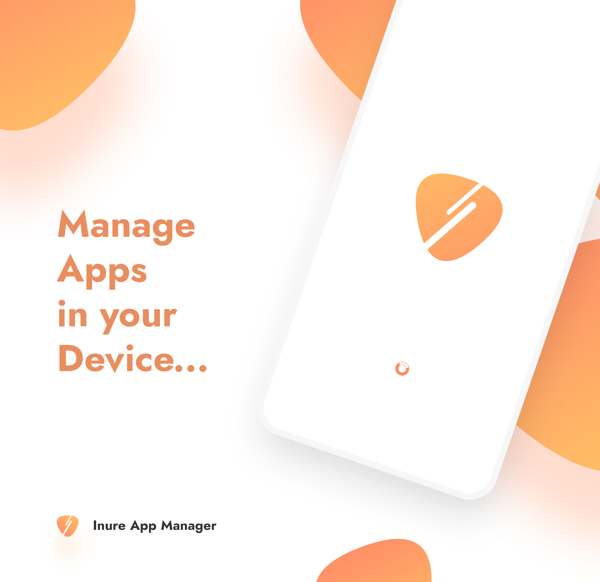
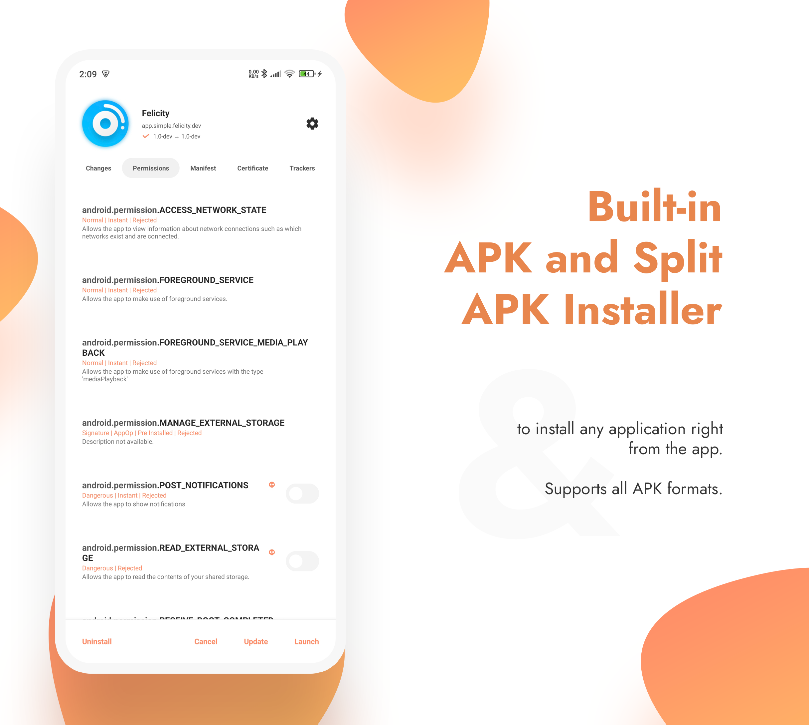

# Inure App Manager

An elegant Android app manager, currently in development

## Stats

## Featured

- [Android Weekly Issue #465](https://androidweekly.net/issues/issue-465)
- ["Inure, a beautifully animated Android App Manager." - Android Dev Notes](https://twitter.com/androiddevnotes/status/1389111968670179340)
- [Top 5 Android Apps of the Week - NextPit](https://www.nextpit.com/apps-of-the-week-51-2021)
- [Top 4 App in User's Choice on PDALife.com](https://pdalife.com/android/sistemnye/sort-by/popular/) _(
  27 July, 2022)_ 💀

## About

Inure is an Android application package manager irrespective of whether they're installed or not, it
can scan through any app's internal components and modify them on the go. It also packs a nice
looking Terminal Emulator, Usage Stats, Split/APK Installer and various other tools and many of them
are waiting to be implemented as well.

Inure's development was started as an independent learning project which later has become one of the
most ambitious and intuitive Android apps developed by a single person and is based 100% on custom
UI APIs developed to be used only in this app with its own native theme engine, crash handler, image
renderer and a beautiful animation framework.

Along with it own UI perks, Inure also supports dynamic Material You colors with split accent and
theme color modes.

Currently, the app is in beta testing stage. You can join app's early beta testing
from [Play Store](https://play.google.com/store/apps/details?id=app.simple.inure) and
its [Telegram Group](https://t.me/inure_app_manager) for development related updates
and discussions.

If you've tried the app, you can write your user/developer feedbacks .

## Development Status

High priority features

- [x] Apps Backup feature
- [x] Dedicated app installer
- [x] External APK information
- [x] Proper analytics panel
- [x] App directories panel
- [ ] APK browser for apps that are not yet installed
- [ ] Modify Shared Prefs of other apps (root).
- [ ] Modify SQLite databases of other apps (root).
- [ ] Multiple user support (suspended).
- [ ] Use app via ADB Shell instead of root? (suspended)
- [x] Add battery optimisation manager for all apps

Low priority features

- [ ] Code highlights for all languages an Android app possibly contains
- [x] Dedicated TextEditor
- [x] ImageViewer scalable zoom support
- [ ] APK data extraction

*This list will be updated as the development progresses*

## Screenshots

|  |  |  |  |
|:---------------------------------------------------------------------:|:---------------------------------------------------------------------:|:---------------------------------------------------------------------:|:---------------------------------------------------------------------:|
|                                   1                                   |                                   2                                   |                                   3                                   |                                   4                                   |

|  |  |  |  |
|:---------------------------------------------------------------------:|:---------------------------------------------------------------------:|:---------------------------------------------------------------------:|:---------------------------------------------------------------------:|
|                                   5                                   |                                   6                                   |                                   7                                   |                                   8                                   |

|  |  |  |  |
|:---------------------------------------------------------------------:|:---------------------------------------------------------------------:|:---------------------------------------------------------------------:|:---------------------------------------------------------------------:|
|                                   9                                   |                                   0                                   |                                   A                                   |                                   B                                   |

|  |  |  |  |
|:---------------------------------------------------------------------:|:---------------------------------------------------------------------:|:---------------------------------------------------------------------:|:---------------------------------------------------------------------:|
|                                   C                                   |                                   D                                   |                                   E                                   |                                   F                                   |

## Behind The Scenes

Designing of interface skeletons for Inure

## License

While the project is GPLv3 licensed, you're not allowed to publish any unofficial builds of the
project on any app store or website. You can however, fork the project and make your own changes to
it. You're also not allowed to use any of the assets of the app in any other projects.
